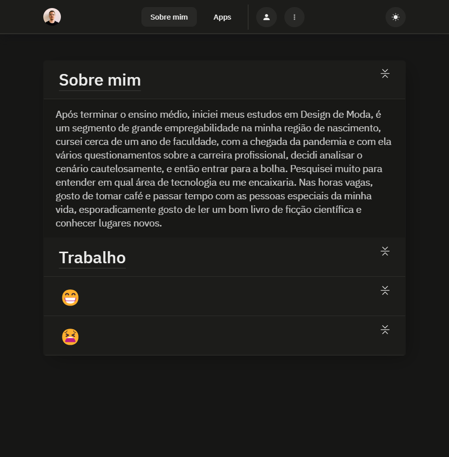

<h1 align="center">
   Portfólio - Rafael Bernardino
</h1>

<h4 align="center"><a href="https://rafaelbernardino.vercel.app/">Clique para visitar o projeto</a></h4>

## 📚 Seções

O site é composto por três seções:

-  **Home:** Onde temos uma breve apresentação e meus projetos/futuros projetos
-  **Sobre mim:** Nesta seção, temos um resumo mais detalhado sobre um pouco da minha história e experiência profissional
-  **Apps:** A seção apresenta as ferramentas que eu utilizo no meu dia a dia.

---

## 💼 Tecnologias utilizadas

Para o desenvolvimento deste site utilizei as seguintes tecnologias:

-  HTML;
-  Styled Components;
-  JavaScript;
-  ReactJS;
-  React Modal
-  React Router Dom
-  Animate
